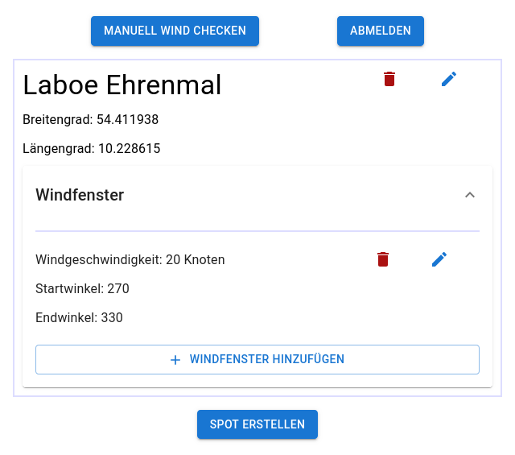
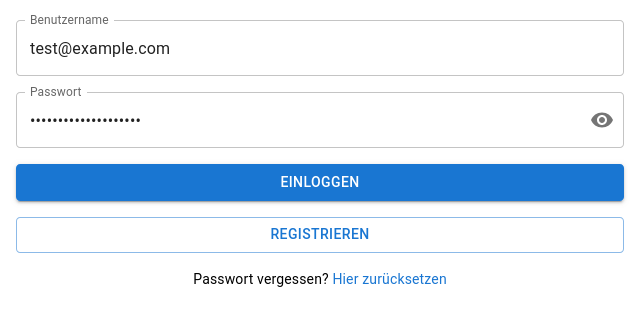
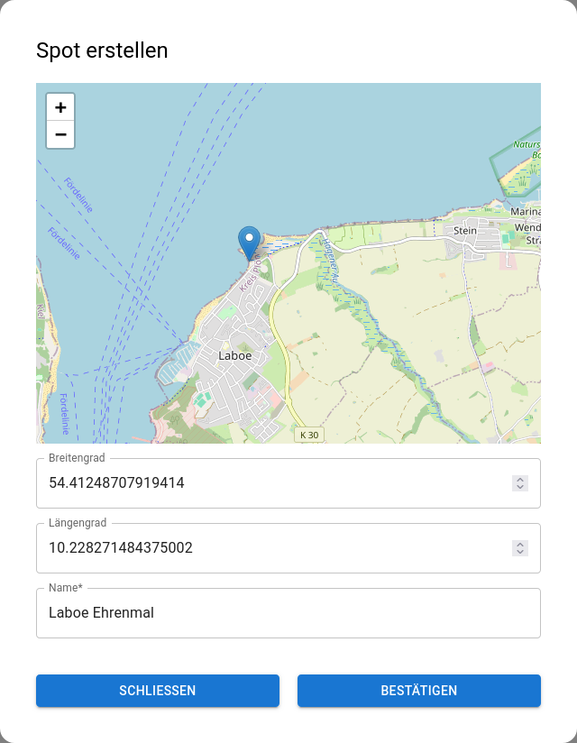
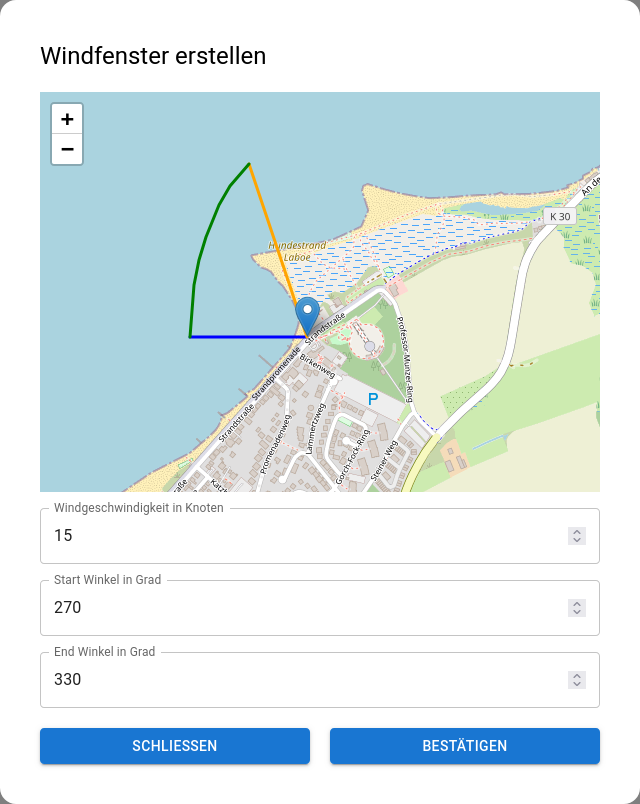

# WindAlert

An E-Mail-Alert-System for your personal favorite Kitesurfing-Spots.



Create a user account with your personal e-mail you want to get the alerts sent to:

Then add your kitesurfing spots via mouse-drag on the map:

Create wind windows with the windconditions for each spot you want to be alerted for:


All that is left to do now is wait for some good conditions and get alerted in the morning as soon as some good
conditions are forecasted. It operates in the UTC+1 (central european time) timezone.

## Starting it locally

### Docker Compose

Create a `.env`-file that sets the necessary environment variables.

```
GH_USER=yourgithubusername
PG_USER=yourusername
...
```

The images are automatically built and pushed to GHCR via GitHub Actions.
You can pull and start the system with:

```
docker compose pull
docker compose up -d
```

For local development building:
1. Uncomment `# build: .` in `docker-compose.yml`
2. Run `docker compose up --build`

### Backend

#### Environment variables

```
JWT_SECRET=LongSequenceToFulfillSecurityRequirementsTheMoreTheBetterChangeThis;
MAIL_SMTP=smtp.example.com;
MAIL_PORT=587;
MAIL_USERNAME=YourMailUsername;
MAIL_PASSWORD=YourMailPassword;
PG_PASSWORD=yourpassword;
PG_USER=yourusername;
PG_HOST=localhost;
PG_PORT=15432
```

#### CLI options

```
--app.ui=./frontend/dist
```

### Frontend

#### Build for 8080

```
npm run build
```

#### Dev with hot reloading

```
npm run dev
```

## TODO's

- Logo
- Toasts which show that data was changed etc. via request
- Arriving at home page first time shouldn't throw error -> distinguish outdated jwt and no jwt or something

## Deploy new changes

docker compose down && docker compose up --build -d

